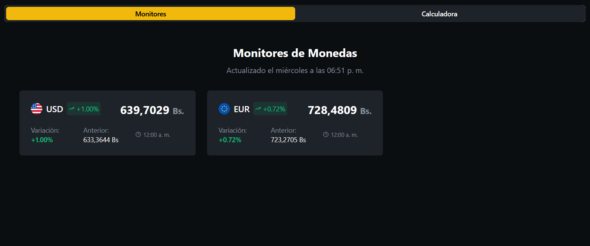

# Central de Monedas VE 

  Una aplicación web sencilla y potente para consultar tasas de cambio de monedas extranjeras en Venezuela en tiempo real.

[Enlace a la Web](https://endearing-starburst-8a9bf9.netlify.app/)

## 📝 Vistazo General

El proyecto busca solucionar la necesidad de tener en un solo lugar la información actualizada de los principales indicadores monetarios, ofreciendo además una herramienta de conversión directa y fácil de usar.

  
  &nbsp;&nbsp;&nbsp;&nbsp;
  

## ✨ Características Principales

* **📈 Monitores en Tiempo Real:** Visualiza el valor actualizado del Dólar (USD) y Euro (EUR) frente al Bolívar (VES).
* **📊 Indicadores de Variación:** Conoce de un vistazo la fluctuación del mercado con el porcentaje de variación y el valor anterior.
* **💱 Calculadora de Conversión:** Convierte montos de forma rápida y precisa entre las monedas disponibles.
* **📱 Diseño Responsivo:** Interfaz limpia y adaptada para una excelente experiencia tanto en escritorio como en dispositivos móviles.
* **🕒 Fecha de Actualización:** Siempre sabrás cuán reciente es la información que estás consultando.

---

  Desarrollado con ❤️ por Rafael

